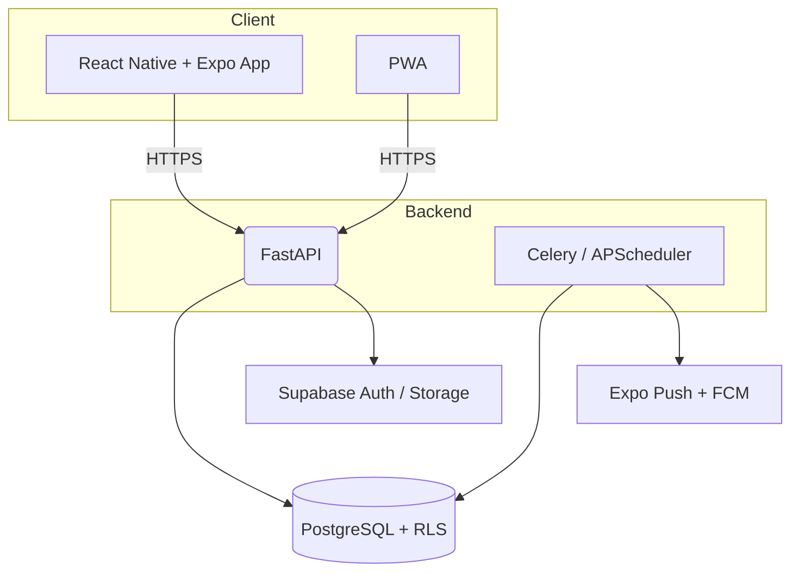

# Cleaning Tracker

This repository hosts **Cleaning Tracker**, a cross-platform (iOS · Android · Web) application that helps households plan, schedule and track their chores through shared calendars, automatic reminders and actionable dashboards. It is built on a Python/PostgreSQL back end and a single React Native + Expo front end, with fully automated CI/CD pipelines and cloud-hosted infrastructure for painless scaling and zero-ops maintenance.

## ✨ Features

### MVP Sprint 1

* Email / password authentication and household creation
* Chore catalogue with custom tasks
* Recurrence engine generating calendar events
* Day | Week | Month calendar views
* Push / email reminders with “snooze” support

### v1.1 Sprint 2

* Completion history & KPI dashboard
* Member-level assignment and filtering
* CSV / Excel exports

### v1.2 Sprint 3

* Task duplication & estimated duration
* Comments + photo proof
* Eco-friendly product sheets & DIY recipes

## 🗺️ MVP Sprint 1 — TODO

### 🛠️ Setup & BDD

* [x] **Initialiser le projet Supabase** (création du project cloud, configuration `.env` locale)
* [x] **Écrire & exécuter la migration `init_schema`** pour toutes les tables + RLS

### 🛠️ API FastAPI

* [ ] **Bootstraper le dossier `api/`** avec `uv init` (structure packages, virtualenv)
* [ ] **Configurer `pydantic-settings`** pour charger les variables d’environnement (URL & clés Supabase, DSN Postgres)
* [ ] **Mettre en place la connexion DB** (`asyncpg` pool + Supabase PostgREST client)
* [ ] **Définir modèles Pydantic** : User, Household, Room, TaskDefinition, TaskOccurrence
* [ ] **Middlewares FastAPI** : CORS, logging, gestion d’erreurs
* [ ] **Intégrer l’auth Supabase** (vérification JWT / rôle `authenticated`, dépendance `get_current_user`)
* [ ] **Endpoints Auth** (`/auth/signup`, `/auth/login`, `/auth/refresh`) + flux **création / rejoindre un foyer**
* [ ] **Routes CRUD Catalogue & Tâches personnalisées** (`/tasks`, `/catalog`)
* [ ] **Endpoints Occurrences & Snooze** (`/occurrences`, `/occurrences/{id}/snooze`)
* [ ] **Documentation OpenAPI** (Swagger / ReDoc) générée automatiquement

### 🔄 Récurrence & Notifications

* [ ] **Service de récurrence** (Edge Function Python ou Celery beat) : RRULE → `task_occurrences`
* [ ] **Rappels Push & Email** via Expo Push + template email Supabase / Resend + endpoint **snooze**
* [ ] **Configurer Celery & broker Redis** + worker container

### 🖼️ Front-end Expo

* [ ] **Vue Calendrier** Day · Week · Month avec `react-native-calendars` (ou Tamagui Calendar)

### ✅ Qualité & CI/CD

* [ ] **Tests Unitaires & E2E** (Pytest pour l’API, Maestro pour l’app) couvrant le parcours MVP
* [ ] **Pipeline CI GitHub Actions** : lint, tests, `supabase db push`, build Expo EAS preview


## 🧰 Tech Stack

| Layer              | Choice                             | Rationale                                                                       |
| ------------------ | ---------------------------------- | ------------------------------------------------------------------------------- |
| **Database**       | PostgreSQL 16 + Row Level Security | Fine-grained multi-tenant access control ([PostgreSQL][1])                      |
| **Backend**        | FastAPI (Python 3.12)              | Async, Pydantic-typed, background jobs out-of-the-box ([FastAPI][2])            |
| **Scheduled Jobs** | Celery 6 + APScheduler 4           | Robust distributed workers ([GitHub][3], [apscheduler.readthedocs.io][4])       |
| **BaaS**           | Supabase                           | Managed Postgres + Python Edge Functions ([Supabase][5], [Supabase][6])         |
| **Frontend**       | React Native 0.78 + Expo SDK 53    | New Architecture (bridgeless) enabled by default ([React Native][7], [Expo][8]) |
| **Build & OTA**    | Expo EAS Build                     | Cloud builds, over-the-air updates ([Expo Documentation][9])                    |
| **Testing**        | Maestro flows + Pytest             | Unified mobile/web UI tests ([maestro.mobile.dev][10])                          |
| **Monorepo**       | Turborepo                          | High-performance task graph caching ([Turborepo][11])                           |

## 🏗️ Architecture Overview



* **Edge Functions** (Supabase) are used for lightweight webhooks and cron fan-out. ([Supabase][5])
* **Celery beats** create future occurrences; **APScheduler** handles ad-hoc snoozes inside the API container. ([GitHub][3], [apscheduler.readthedocs.io][4])
* Push notifications are unified via Expo’s single endpoint, reaching iOS, Android and web browsers. ([Expo Documentation][9])

## 🚀 Getting Started

### Prerequisites

* **Node ≥ 20** and **pnpm** for the front end
* **Python 3.12** + **UV** for the API
* A free Supabase project (set the URL and anon key below)

### Clone & bootstrap

```bash
git clone https://github.com/your-org/cleaning-tracker.git
cd cleaning-tracker
pnpm install          # installs all JS workspaces (expo, web, ui, etc.)
uv install           # installs Python dependencies
turbo run build       # optional: warm the task cache
```

### Environment variables

Create **.env** at the repo root:

```dotenv
SUPABASE_URL=...
SUPABASE_ANON_KEY=...
EXPO_PUBLIC_SUPABASE_URL=$SUPABASE_URL
EXPO_PUBLIC_SUPABASE_ANON_KEY=$SUPABASE_ANON_KEY
POSTGRES_PASSWORD=...
```

### Local dev

```bash
# 1. Start Postgres (Docker)
docker compose up db

# 2. Run API with live-reload
uv run uvicorn app.main:app --reload

# 3. Launch Expo in web / mobile
pnpm --filter mobile expo start --web
```

The default seeds create a demo household, catalogue and sample tasks.

### Tests

```bash
# API unit tests
uv run pytest -q

# End-to-end mobile flow
maestro test flows/first_login.yaml   # Android & iOS simulators
```

CI executes **Pytest**, **Maestro**, and linting jobs in parallel via **GitHub Actions** using Turborepo’s remote cache for speed.

## 🛠️ Useful Commands

| Task                         | Command                                            |
| ---------------------------- | -------------------------------------------------- |
| Generate DB migrations       | `alembic revision --autogenerate -m "feat: tasks"` |
| Run Celery workers           | `uv run celery -A app.worker worker -l info`   |
| Trigger Expo OTA update      | `eas update --branch production`                   |
| Invoke Edge Function locally | `supabase functions serve generate-occurrences`    |

## 📦 Deployment

| Target        | Description                                                    |
| ------------- | -------------------------------------------------------------- |
| **Supabase**  | Provisioned Postgres, Auth, Storage + Edge Functions           |
| **Cloud Run** | Containerised FastAPI + Celery workers (min = 0 instances)     |
| **EAS Build** | Release binaries signed & uploaded to App Store / Play Console |

CI/CD pipelines auto-tag Docker images, promote Supabase migrations and publish Expo OTA updates after successful test suites.

## 🔗 Resources

* Supabase Edge Functions overview ([Supabase][5])
* Python invocation example ([Supabase][6])
* FastAPI Background Tasks ([FastAPI][2])
* React Native 0.78 release blog ([React Native][7])
* Expo SDK 53 changelog ([Expo][8])
* Celery 6 release notes ([GitHub][3])
* APScheduler 4 version history ([apscheduler.readthedocs.io][4])
* EAS Build documentation ([Expo Documentation][9])
* Maestro testing docs ([maestro.mobile.dev][10])
* Turborepo docs ([Turborepo][11])
* PostgreSQL RLS guide ([PostgreSQL][1])

## 🤝 Contributing

1. Fork the repo & create a feature branch.
2. Follow the coding-style conventions enforced by **ruff** and **prettier**.
3. Add unit + integration tests for any new behaviour.
4. Open a PR and ensure the GitHub Actions pipeline passes.

## 📝 License

Cleaning Tracker is released under the MIT License. See `LICENSE` for details.

Enjoy keeping your home organised!

[1]: https://www.postgresql.org/docs/current/ddl-rowsecurity.html?utm_source=chatgpt.com "Documentation: 17: 5.9. Row Security Policies - PostgreSQL"
[2]: https://fastapi.tiangolo.com/tutorial/background-tasks/?utm_source=chatgpt.com "Background Tasks - FastAPI"
[3]: https://github.com/celery/celery/releases?utm_source=chatgpt.com "Releases · celery/celery - GitHub"
[4]: https://apscheduler.readthedocs.io/en/master/versionhistory.html?utm_source=chatgpt.com "Version history — APScheduler documentation - Read the Docs"
[5]: https://supabase.com/docs/guides/functions?utm_source=chatgpt.com "Edge Functions | Supabase Docs"
[6]: https://supabase.com/docs/reference/python/functions-invoke?utm_source=chatgpt.com "Python: Invokes a Supabase Edge Function."
[7]: https://reactnative.dev/blog/2025/02/19/react-native-0.78?utm_source=chatgpt.com "React Native 0.78 - React 19 and more"
[8]: https://expo.dev/changelog/sdk-53?utm_source=chatgpt.com "Expo SDK 53 - Expo Changelog"
[9]: https://docs.expo.dev/build/introduction/?utm_source=chatgpt.com "EAS Build - Expo Documentation"
[10]: https://maestro.mobile.dev/?utm_source=chatgpt.com "What is Maestro? | Maestro - Mobile.dev"
[11]: https://turbo.build/repo/docs?utm_source=chatgpt.com "Introduction | Turborepo"
